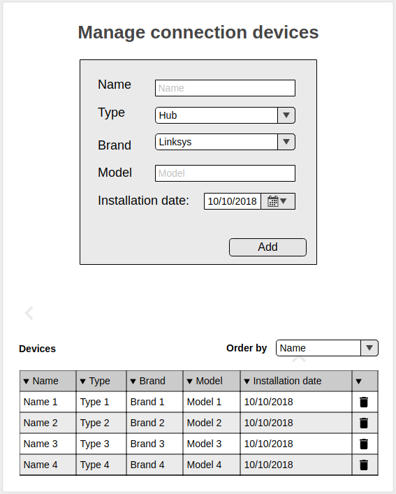

Let's create a page for managing network connection devices as shown in this draft:

The page contain two parts:

First: form to insert devices data with this fields:

 Name: input text. For example: 'Router_5021'
 Type: input select. Options: Hub, Switch, Modem, Router, Bridge and Repeater
 Brand: input select. Options: Linksys, C‹isco, Surecom and Cnet
 Model: input text. For example 'MD2018'
 Installation date: input date

Second: Table for show devices data with this columns:

 Name, Type, Brand, Model, Installation date and remove option

Attached image with the basic design of the page.

Functions to be implemented:

~~Implement validate function. Validate that there are no empty fields before insert device data.~~

- Implement insert function. When you press 'Add' button you should automatically insert a new row in the table with the device data.
- Implement remove function. When you press remove button you should automatically delete a correspondent row in the table.
- Implement sorting function. The rows can be sorted by: Name (A-Z) or Installation date (most recent). When you select sort options you should automatically sort rows in the table.

Requirements: 
- For the implementation you should only use basic javascript. Don't use external libraries such as Moment.js, Bootstrap and others.
- This exercise should be done within 2 hours. In case you feel the code could be improved, please, add comments to the code where appropriate.
